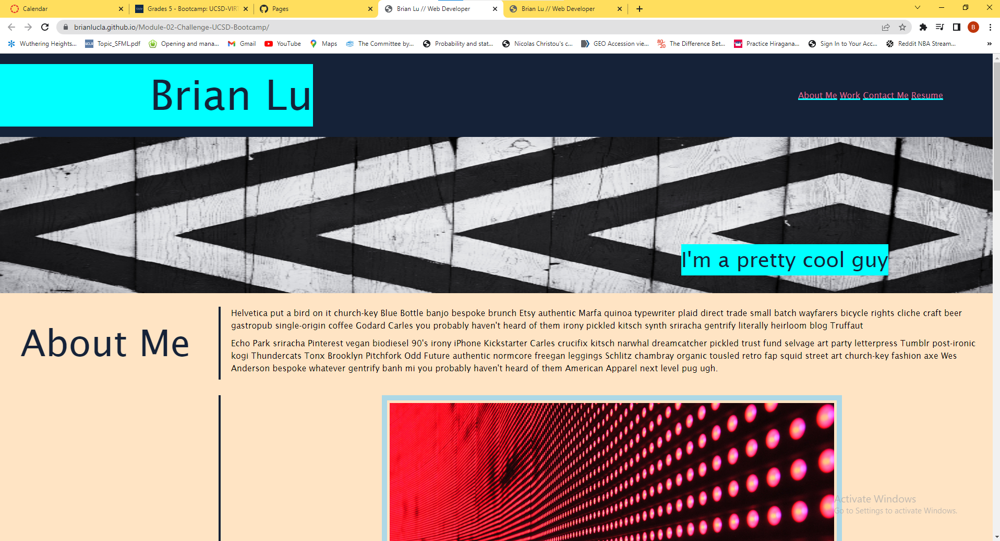

# Module-02-Challenge-UCSD-Bootcamp
Create a functional portfolio that allows employers to view an applicant's deployed websites

# Applicant Portfolio Webpage

## Description

We created a webpage that displays an applicant's portfolio. This webpage includes contact information, a section for the applicant to talk about themselves, and a section that displays all of the applicant's deployed websites and projects. We built this project to make an applicant's information more organized and accessible for employers to view. This project ensures that employers have quick access to all of the applicant's personal information, as well as the work they have done before. From making this webpage, I learned how to effectively format and style HTML elements in CSS.

## Installation

N/A

## Usage

The header has links to the applicant's contact and links to the following sections as well as a resume. The About Me section contains personal information about the applicant. The Work Section contains the applicant's deployed projects as well as links to those websites. The Contact Me lists the applicants contact information and their links.

## Credits

I received help from TA's on formatting the images in the work section, specifically in #first-image and .img-rest.

## License

Please refer to the license provided in the Github Repository

---

## Screenshot and Link

https://brianlucla.github.io/Module-02-Challenge-UCSD-Bootcamp/

